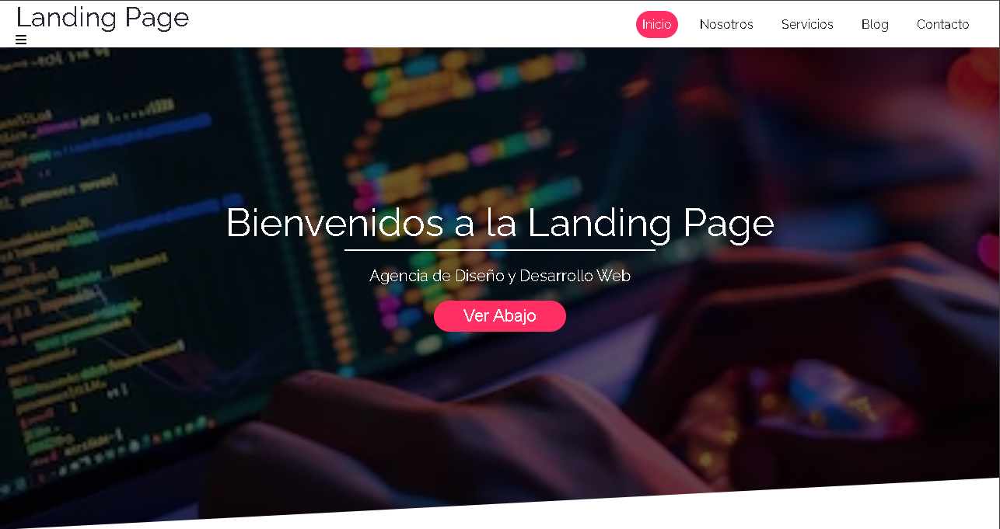
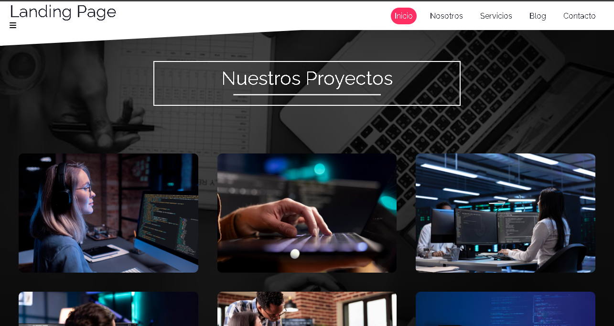

# Mi Proyecto de Landing Page

Este es un proyecto de una landing page básica que he mejorado a partir de un tutorial. Aquí puedes ver algunas capturas de pantalla que muestran el diseño y la funcionalidad.

## Capturas de Pantalla

### Vista Principal


### Captura de Sección de Proyectos


## Descripción

Esta landing page incluye características como:
- **Diseño Responsive**: Se adapta a diferentes tamaños de pantalla.
- **Estilos Personalizados**: He implementado estilos únicos para mejorar la apariencia.
- **Interactividad**: Añadí elementos interactivos para mejorar la experiencia del usuario.

## Tecnologías Utilizadas

- HTML
- CSS
- JavaScript/JQuery

## Cómo Ejecutar el Proyecto

1. Clona el repositorio:
   ```bash
   https://github.com/jordanmax10/basic-landing-page.git
